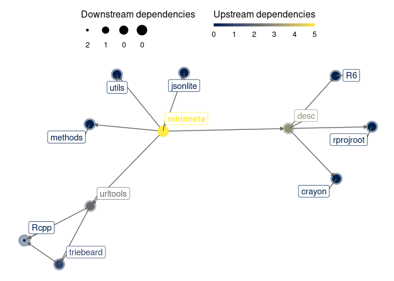
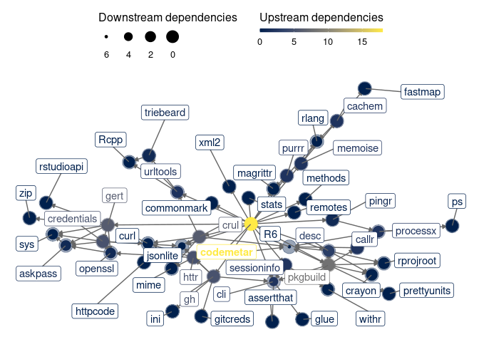

<!-- README.md is generated from README.Rmd. Please edit that file -->

# codemeta

<!-- badges: start -->

[](https://github.com/cboettig/codemeta/actions)
[](https://app.codecov.io/gh/cboettig/codemeta?branch=master)
<!-- badges: end -->

`codemeta` is a smaller, simpler `codemetar`.

## Installation

You can install the released version of codemeta from
[CRAN](https://CRAN.R-project.org) with:

``` r
install.packages("codemeta")
```

And the development version from [GitHub](https://github.com/) with:

``` r
# install.packages("devtools")
devtools::install_github("cboettig/codemeta")
```

## Example

``` r
codemeta::write_codemeta()
```

## Dependencies

``` r
# remotes::install_github("crsh/depgraph")
# remotes::install_github("jimhester/itdepends")
depgraph::plot_dependency_graph(".", suggests = FALSE)
```



``` r
depgraph::plot_dependency_graph("../../ropensci/codemetar", suggests = FALSE)
```


